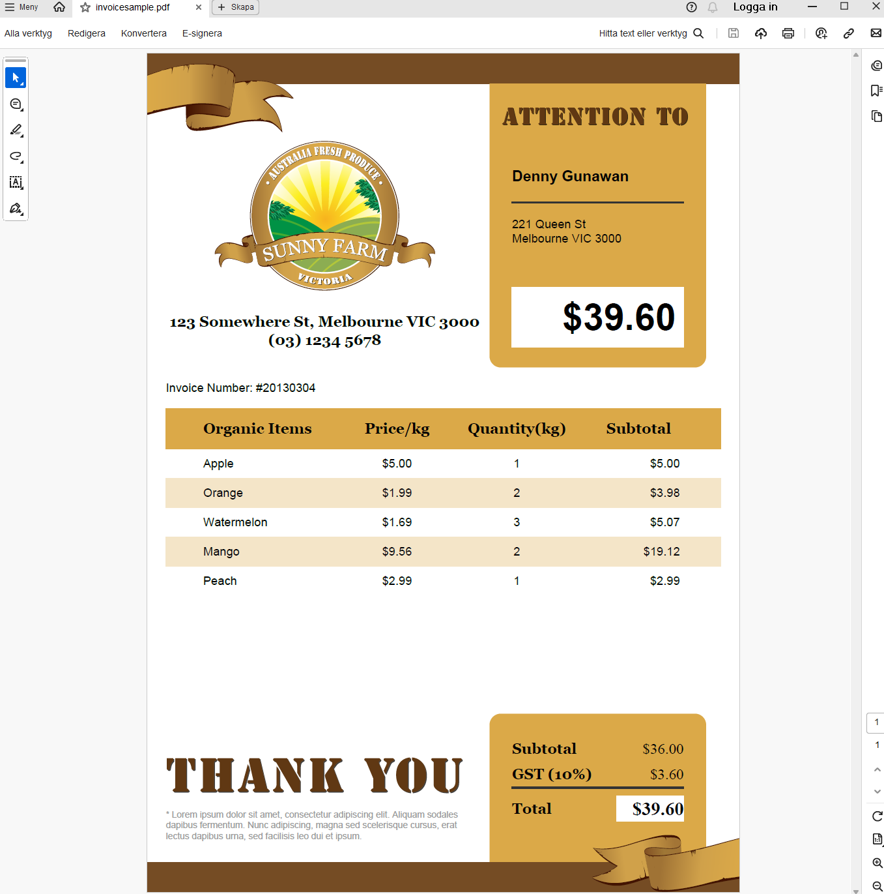
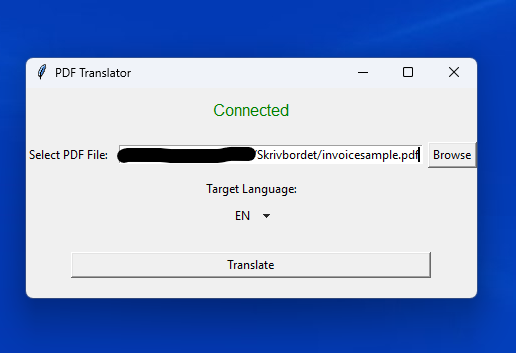
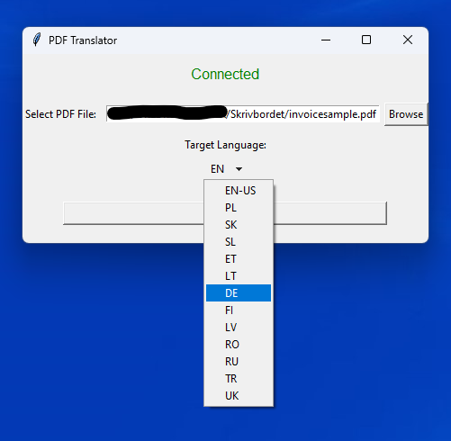
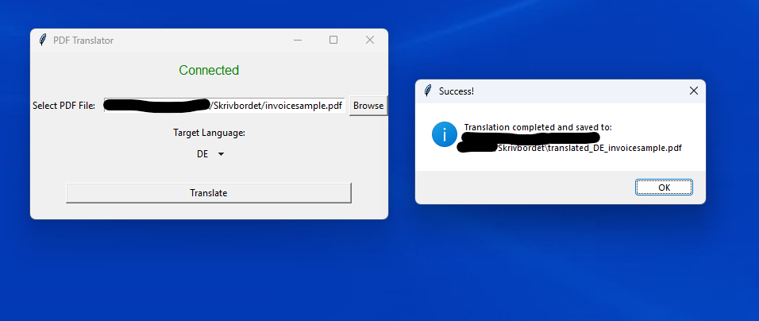
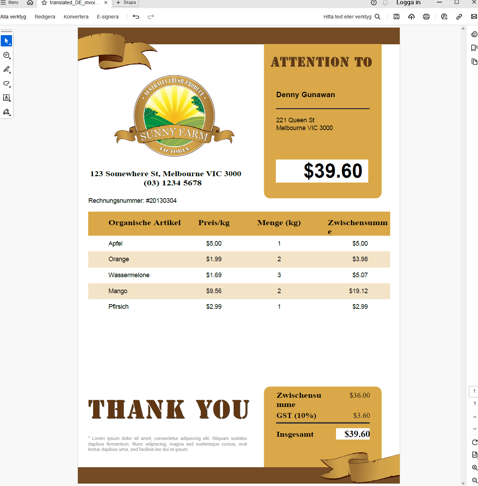

# PDFTranslator
A software that uses deepl's translation api to translate pdf documents

If you want to use this program, you need to make an account at deepl.com and get an API key.

Remove this line:

```Python
from config import api_key as key
```

In the translate() function you can change this line

```Python
api_key = key
```

To

```Python
api_key = "your-api-key-here"
```

-------------------------------------------------------------------------------------
#How it works

Takes in a PDF File





Choose a language



Translate



And you have a translated version of the document!


